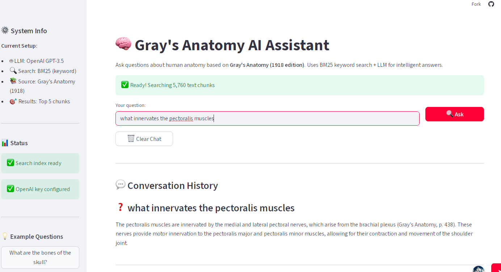

# graysanatomy_agent
AI agent trained on classic Gray's Anatomy anatomy text

Project Structure:
```
graysanatomy_agent/
│
├── app.py                # Streamlit app entry point
├── config.py             # Configuration (model, search parameters)
├── data_loader.py        # Loads and preprocesses anatomy text
├── search.py             # BM25 retrieval engine
├── llm.py                # GPT-3.5 integration for contextual answers
├── requirements.txt      # Python dependencies
├── README.md
├── img/                  # Screenshots and visuals
└── graysanatomy_agent.ipynb  # Notebook for experimentation

```
**Tools:**
Streamlit — web interface

OpenAI GPT-3.5 — language model

Rank-BM25 — text retrieval

Python Requests / dotenv — API integration and config handling

**Access on streamlit**: https://graysanatomyagent.streamlit.app/

**Screenshot:**




